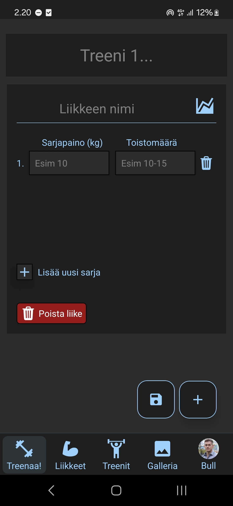
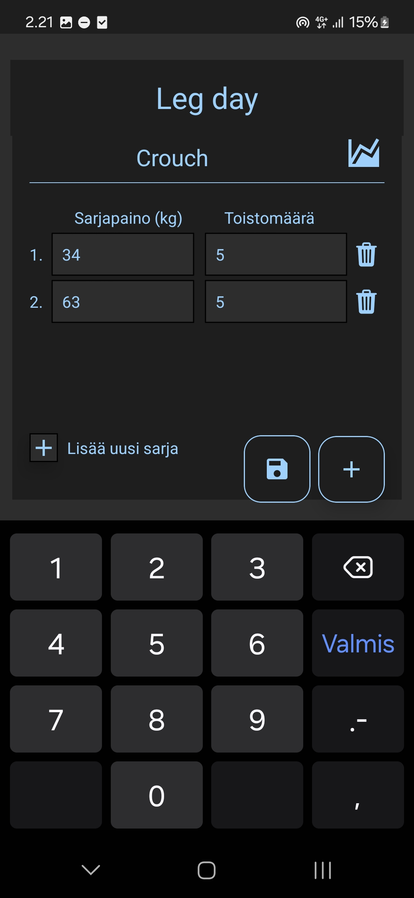
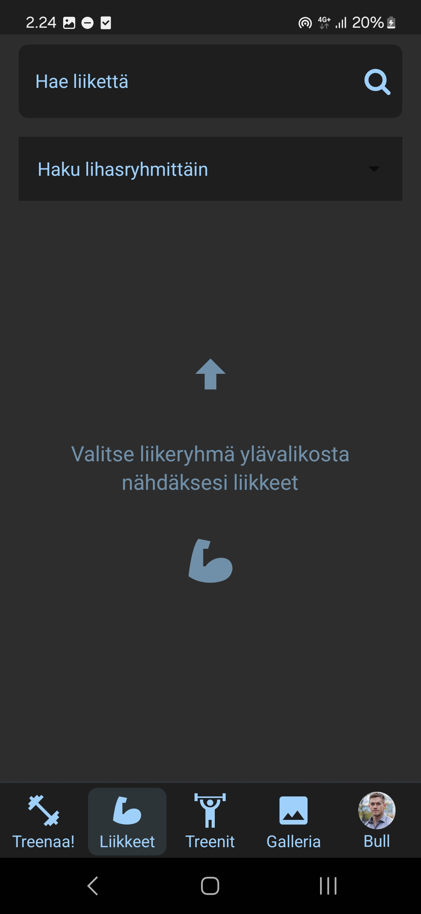
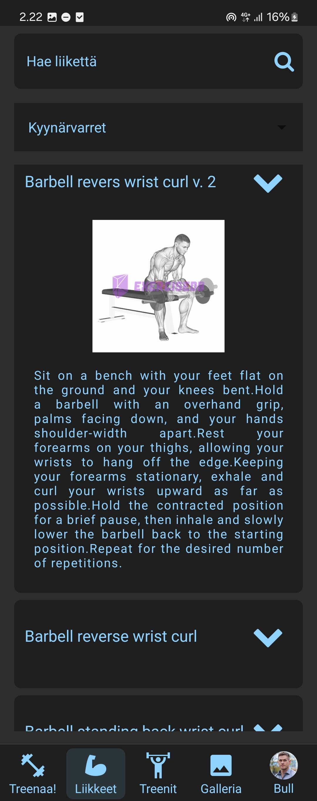
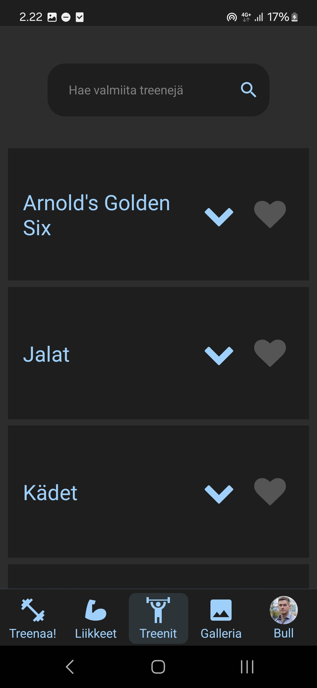
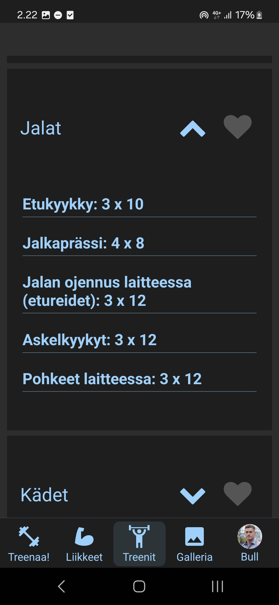
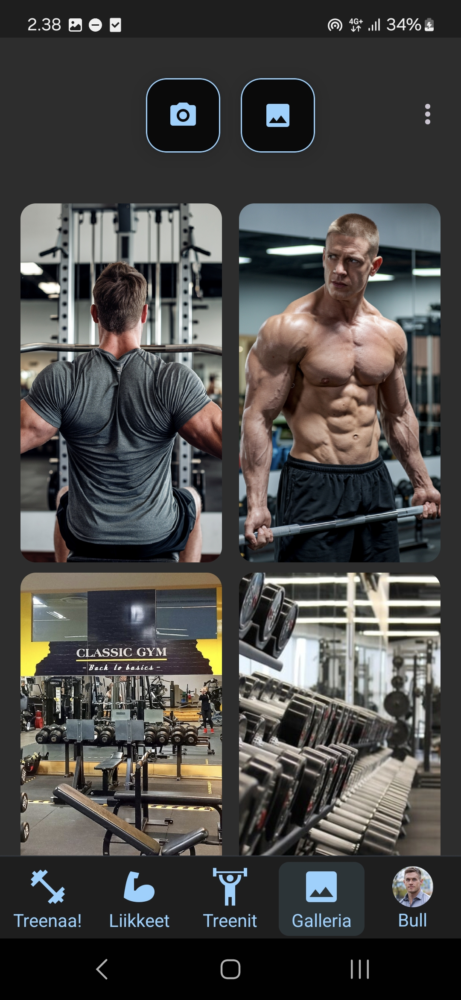
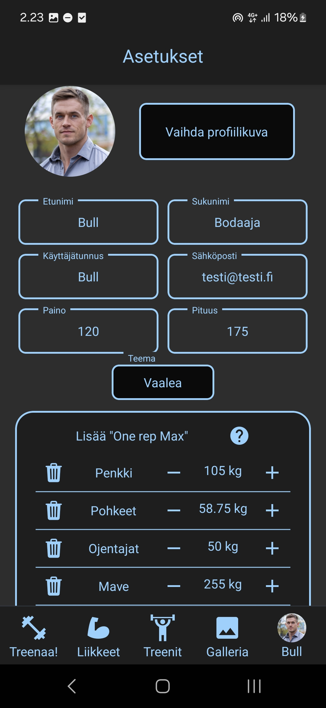

# Simply Gymnotes

Simply Gymnotes on React Native -pohjainen mobiilisovellus, joka on suunniteltu auttamaan käyttäjiä seuraamaan kuntosaliharjoituksiaan. Sovelluksessa voi kirjata harjoitussarjoja, käyttää valmiita harjoitusohjelmia, lisätä galleriaan kuvia ja katsella tilastoja harjoituksista.

## Sovelluksen näkymät

### Treenisivu

Aloitusnäkymässä voit kirjata kuntosaliharjoituksesi sarjat ja toistot. Helppokäyttöinen käyttöliittymä mahdollistaa nopean kirjaamisen kesken treenin.

Esimerkki treenisivun käytöstä.

### Liikepankki

Liikepankista löydät kattavan valikoiman kuntosaliliikkeitä. Voit hakea liikkeitä nimellä tai selata kategorioittain.

Esimerkki liikepankin hausta - hakemalla liikkeen nimellä (esim. "Leg curl") saat näkyviin tarkat tiedot kyseisestä liikkeestä.

### Valmiit treeniohjelmat

Valmiit treeniohjelmat -osiosta löydät erilaisia kuntosaliohjelmia eri tavoitteisiin.

Jokainen treeniohjelma sisältää ohjeet harjoituksen suorittamiseen.

### Galleria

Galleriaan voit tallentaa kuvia esimerkiksi harjoituksistasi.

### Asetukset

Asetussivu.

## Ominaisuudet

- Harjoitussarjojen seuranta ja tallennus
- Kattava liikepankki hakutoiminnolla
- Valmiit treeniohjelmat
- Kuvagalleria edistymisen seurantaan
- Tilastot harjoituksista
- Helppokäyttöinen käyttöliittymä
- Tietojen tallennus Firebase-tietokantaan

## Teknologiat

- React Native
- Firebase Database & Storage
- Expo
- React Navigation
- JavaScript

## Kehittäjät

Sovellus kehitettiin osana Oulun Ammattikorkeakoulun mobiilisovellusprojektia.

Juho Kultala (Kuljuho), Taneli Lesell (TaneliNH), Jaakko Mattila (mattilja88) ja Antre Ahonen (antreahonen).
